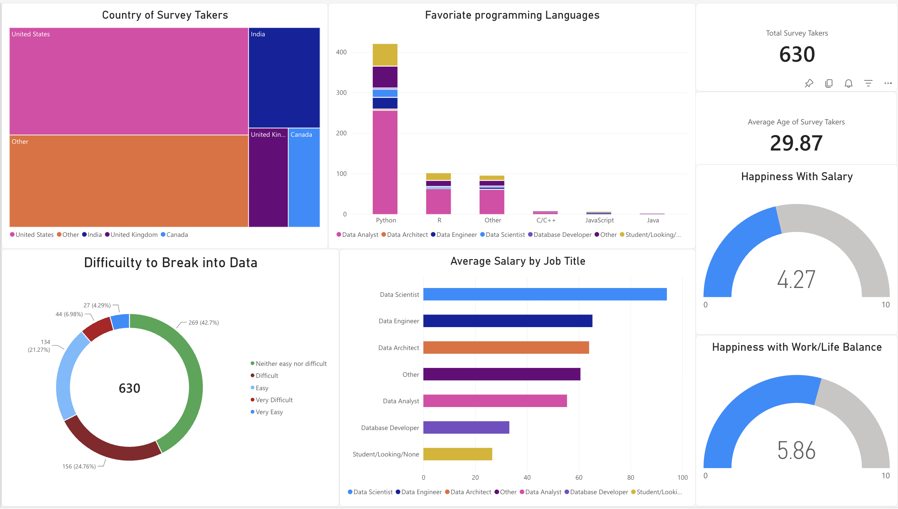

# Data Professional Survey — Power BI Dashboard

An interactive Power BI dashboard analyzing a **real-world survey dataset of 630 data professionals**, exploring salary, job satisfaction, career-entry difficulty, and tooling preferences across roles, countries, and programming languages.

## 📌 Overview

This project analyzes responses from 630 working data professionals to answer questions like:

- What programming languages do data professionals actually use, by role?
- How does average salary differ across job titles?
- How difficult is it to break into a data career?
- How happy are professionals with their salary and work/life balance?
- Where in the world do respondents work?

## 📊 Dashboard Features

The dashboard includes six linked visuals on a single page:

| Visual | Insight |
|---|---|
| **Country Treemap** | Geographic distribution of survey respondents |
| **Favorite Programming Languages (Stacked Bar)** | Language preference broken down by job title |
| **Difficulty to Break into Data (Donut Chart)** | Distribution of responses from "Very Easy" to "Very Difficult" |
| **Average Salary by Job Title (Bar Chart)** | Salary comparison across Data Scientist, Data Engineer, Data Analyst, and other roles |
| **Happiness with Salary (Gauge)** | Average satisfaction score (0–10) |
| **Happiness with Work/Life Balance (Gauge)** | Average satisfaction score (0–10) |

KPI cards also surface total survey takers (630) and average respondent age (29.87).

## 🔑 Key Findings

- **Python dominates** as the favorite programming language across nearly every data role, far ahead of R, SQL/Other, C/C++, JavaScript, and Java.
- **Data Scientists report the highest average salary** of any title, followed by Data Engineers and Data Architects.
- **Breaking into data is still a real hurdle** — while 43% of respondents found it "neither easy nor difficult," roughly 30% called it difficult or very difficult, and only ~11% found it easy or very easy.
- Respondents report moderate happiness with **salary (4.27/10)** but notably higher satisfaction with **work/life balance (5.86/10)**, suggesting compensation is a bigger pain point than day-to-day workload for this group.

## 🛠️ Tools & Skills

- **Power BI Desktop** — data modeling, DAX measures, dashboard design
- **DAX** — calculated measures for average salary, average age, and multi-factor happiness scores (salary, work/life balance, coworkers, management, upward mobility, learning)
- **Data Cleaning** — standardizing categorical survey responses for accurate grouping and visualization
- **Data Visualization** — treemaps, stacked bar charts, donut charts, gauges, and KPI cards

## 📁 Repository Contents

| File | Description |
|---|---|
| `Power_BI_-_Final_Project.xlsx` | Raw survey dataset (630 responses, 27 questions) |
| `PowerBiProject.pbix` | Power BI Desktop file with full data model, DAX measures, and dashboard |
| `PowerBi_Project.png` | Dashboard screenshot / preview image |

## 🚀 How to View

1. Download `PowerBiProject.pbix`
2. Open in [Power BI Desktop](https://www.microsoft.com/en-us/power-platform/products/power-bi/downloads) (free)
3. Explore the dashboard interactively — click any visual to cross-filter the rest of the report

## 📬 Contact

**Zaw Min Thu**
[LinkedIn](https://linkedin.com/in/zaw-min-thu-1212211b7) · [GitHub](https://github.com/zawmint257-droid) · zawmint257@gmail.com
